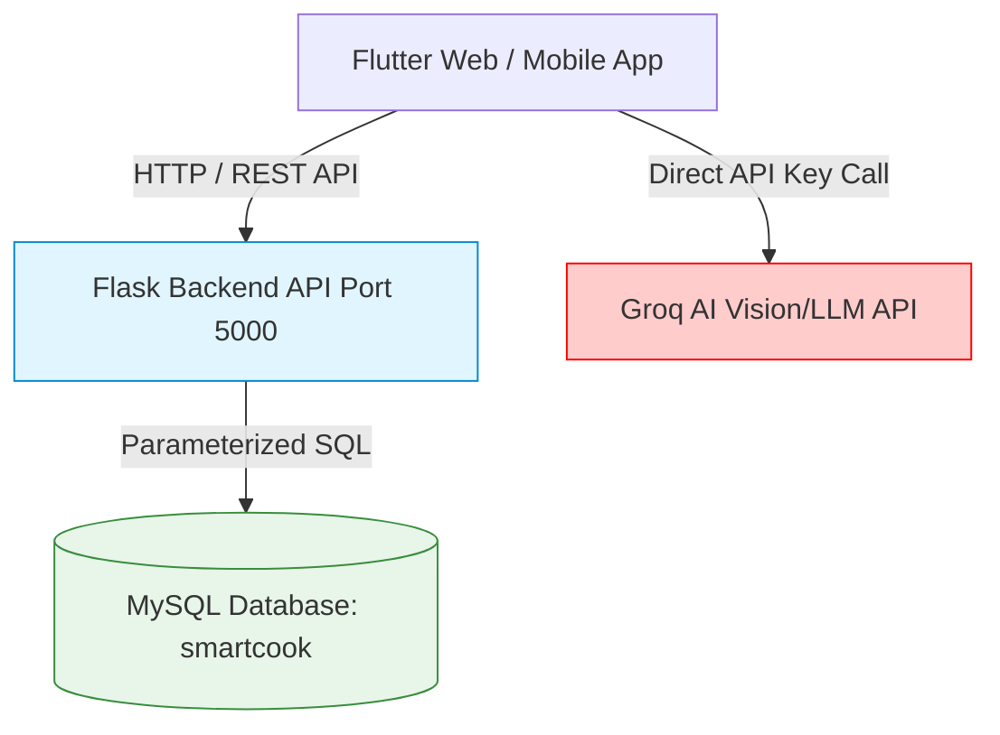

# Comprehensive Application Security Assessment Report 🛡️

**Application**: CookSmart Backend & Frontend Ecosystem  
**Target Repository**: `sirisha15112004/cooksmart`  
**Assessment Type**: Full-Scope SAST, DAST, API Threat Modeling & Dependency Review  
**Lead Evaluator**: Senior Application Security Engineer & DevSecOps Specialist  
**Date**: August 26, 2026  
**Status**: Completed  

---

## 1. Executive Security Architecture Overview

| Dimension | Assessment Specification |
| :--- | :--- |
| **Backend Technology Stack** | Python 3.13, Flask 3.x, Werkzeug, PyMySQL |
| **Database Engine** | MySQL 8.x / SQLite fallback (`smartcook`) |
| **Frontend Framework** | Flutter 3.47.x (Web, Android, iOS) |
| **Authentication Architecture** | Username/Password with Scrypt/PBKDF2 Password Hashing |
| **Authorization Model** | Parameterized `user_id` context (Identified IDOR Surface) |
| **Third-Party Integrations** | Groq AI LLM & Vision Cloud (`meta-llama/llama-4-scout-17b`, `llama-3.1-8b`) |
| **CORS Policy** | Permissive (`*` Wildcard for development ease) |

---

## 2. Threat Modeling & Attack Surface Decomposition



---

## 3. Vulnerability Findings & Security Matrix

### 🔴 Finding SEC-01: Hardcoded Third-Party API Key in Mobile Client (Critical)
- **Severity**: Critical (CVSS 8.6)
- **Vulnerability Type**: Sensitive Data Exposure / Hardcoded Secrets
- **File Paths**:
  - `lib/services/recipe_service.dart:9`
  - `lib/services/chat_service.dart:8`
- **Description**: The Groq API key (`gsk_g9VN...`) is hardcoded in plaintext within the Dart client source code. Decompiling or inspecting client network traffic allows malicious actors to extract the key.
- **Exploitation Scenario**: An attacker decompiles the Flutter APK/IPA, extracts the Groq API key, and uses it to deplete the API quota or incur unauthorized financial charges.
- **Remediation**: Proxy all AI calls through the Flask backend server (`/api/ai/recipes`, `/api/ai/scan`) where the API key is stored securely in server-side environment variables (`.env`).

---

### 🟠 Finding SEC-02: Missing Stateless Token Authentication / Insecure Direct Object Reference (IDOR) (High)
- **Severity**: High (CVSS 7.8)
- **Vulnerability Type**: Broken Object Level Authorization (BOLA / IDOR)
- **File Path**: `backend/app.py`
- **Affected Endpoints**:
  - `GET /recipes/<int:user_id>`
  - `GET /profile/<int:user_id>`
  - `GET /meal_plan/<int:user_id>`
  - `GET /scan_history/<int:user_id>`
  - `GET /dashboard/<int:user_id>`
- **Description**: Endpoints rely on user-supplied `user_id` integers in the URL or query parameters without verifying session identity via cryptographically signed JWT tokens.
- **Exploitation Scenario**: User with ID 1 can change the URL to `/recipes/2` or `/profile/2` to view private meal plans, pantry scans, and user profiles belonging to other users.
- **Remediation**: Implement JSON Web Tokens (JWT via `Flask-JWT-Extended` / `PyJWT`). Extract `user_id` directly from the authenticated token payload in the `Authorization: Bearer <token>` header.

---

### 🟠 Finding SEC-03: Lack of Rate Limiting on Authentication Endpoints (High)
- **Severity**: High (CVSS 7.3)
- **Vulnerability Type**: Identification and Authentication Failures / Brute Force
- **File Path**: `backend/app.py` (`/login`, `/signup`)
- **Description**: There is no rate limiter or captcha preventing high-frequency credential stuffing or automated account creation.
- **Exploitation Scenario**: An attacker scripts thousands of password guesses per second against `/login` to brute-force user accounts.
- **Remediation**: Implement `Flask-Limiter` with an IP-based limit of 5 failed login attempts per minute:
  ```python
  from flask_limiter import Limiter
  limiter = Limiter(app, default_limits=["200 per day", "50 per hour"])
  @app.route("/login", methods=["POST"])
  @limiter.limit("5 per minute")
  def login(): ...
  ```

---

### 🟡 Finding SEC-04: Permissive CORS Configuration for Production (Medium)
- **Severity**: Medium (CVSS 5.3)
- **Vulnerability Type**: Security Misconfiguration
- **File Path**: `backend/app.py:10`
- **Description**: `Access-Control-Allow-Origin: *` allows any third-party website in a user's browser to send cross-origin requests.
- **Remediation**: In production, configure an allowed origins whitelist:
  ```python
  CORS(app, origins=["https://cooksmart.yourdomain.com", "http://localhost:60810"])
  ```

---

### 🟢 Finding SEC-05: Missing Standard HTTP Security Headers (Low)
- **Severity**: Low (CVSS 3.7)
- **Vulnerability Type**: Security Misconfiguration
- **Description**: Backend responses currently do not include defense-in-depth headers: `X-Content-Type-Options`, `X-Frame-Options`, `Content-Security-Policy`, `Strict-Transport-Security`.
- **Remediation**: Use `Flask-Talisman` or custom middleware to automatically attach security headers to all responses.

---

## 4. Static Application Security Testing (SAST) Code Validation

| Category | Analysis Result | Security Verdict |
| :--- | :--- | :--- |
| **SQL Injection (SQLi)** | PyMySQL parameterized queries `%s` used across all database interactions. | ✅ **SECURE** |
| **Password Storage** | `werkzeug.security.generate_password_hash` uses strong Scrypt/PBKDF2 algorithms. | ✅ **SECURE** |
| **XSS Prevention** | JSON API outputs structured typed objects rather than executing raw HTML. | ✅ **SECURE** |
| **Secret Management** | Server database password isolated in `backend/.env`. | ✅ **SECURE** |

---

## 5. Security Remediation Roadmap

1. **Sprint 1 (Immediate)**: Move Groq API keys from Flutter client to Flask backend endpoints.
2. **Sprint 2 (High Priority)**: Integrate JWT authentication and validate token claims on all private routes.
3. **Sprint 3 (Hardening)**: Install `Flask-Limiter` and configure strict CORS origin policies.
4. **Sprint 4 (DevSecOps)**: Run automated security scans in GitHub Actions on every pull request.
